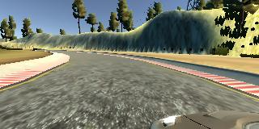
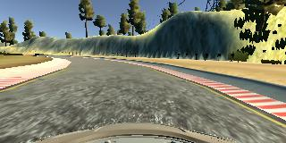
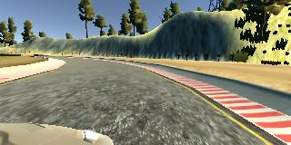
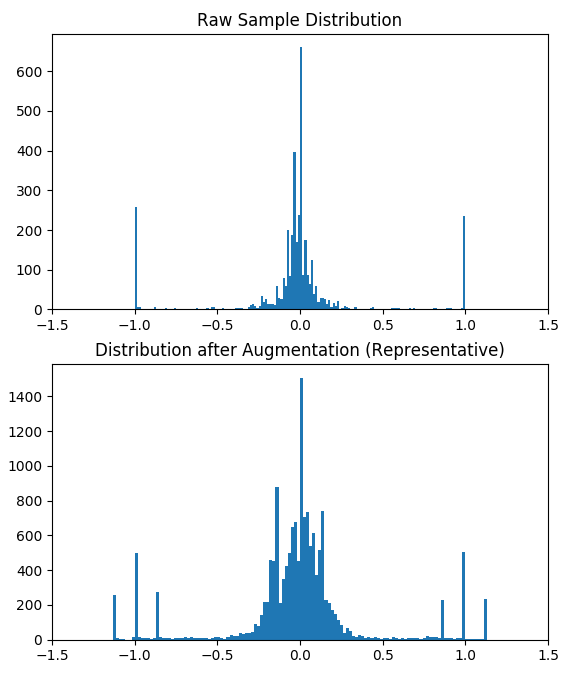
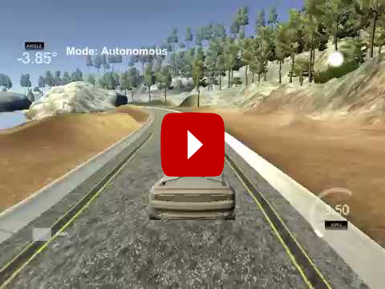
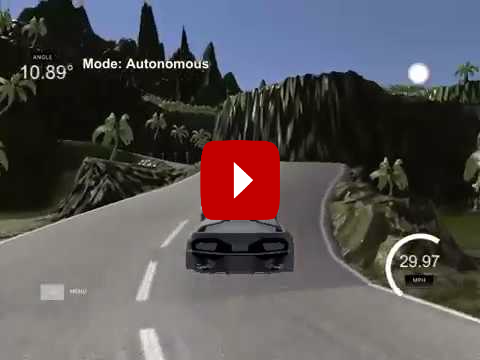

# Behavioral Cloning Project [](http://www.udacity.com/drive)

<a href="http://petermoran.org/"></a>

<p align="center"></p>

<p align="center"></p>

# Overview

In this project, I created a neural network that can navigate a car around a closed track in a 3D simulator, using only visual data and samples from human driving.

The goals of this project were to:

* Use human driving data (from a driving simulator) to train a neural network that predicts steering angles from camera data alone.
* Train and validate the model using a training and validation set.
* Test that the model can drive a car around each track in the simulator, without leaving the road.

This project is largely inspired by Nvidia's research on [End-to-End Deep Learning for Self-Driving Cars](https://devblogs.nvidia.com/parallelforall/deep-learning-self-driving-cars/) and was completed as part of Udacity's Self-Driving Car program. Udacity provided the code for obtaining photos from the simulator and an interface for using pre-trained models to drive the car -- all other work (including designing, training, and tuning models) is my own.

# How it Works

### Sample Collection & Selection

Human driving data is collected in the [Udacity's Car Simulator](https://github.com/udacity/self-driving-car-sim). This program allows you to use your keyboard (or a gaming controller) to drive around each simulated track and saves the view of the road from the car in each frame and the current steering angle. **The whole system relies on these values alone, i.e. it only uses the view of the road to select steering angles (and nothing else)**. The images are all saved to a specified directory, and a CSV files provides each file name and the associated steering angle.

| <p align="center"></p> | <p align="center"></p> |
| ---------------------------------------- | ---------------------------------------- |
| **Simulator View** -- used by the human driver | **Dashboard View** -- used by the neural network |

After collecting data with the simulator, the samples can be viewed as a video using `img_inspect.py`. **This allows for removing any segments of bad human driving** from the sample set. This is really important. If we train on bad driving, our network will optimize for bad driving. In addition, we further refine our sample selection by dropping 65% of the samples with an angle of zero because it is overrepresented in the dataset.

#### Augmentation

Rather than just using the raw samples recorded from human driving, we augment the dataset with additional computer-generated samples. This is first done by adding a flipped version of nearly every sample, this way we can keep the distribution of left and right turns roughly symmetrical.

However, the most important form of augmentation is using cameras from the side of the car with a modified course-correcting angle. Specifically, the view from the side of the car *is treated as if it was the center of the car*. This means it is showing a view of the car too far to the left or right according to our human driver. Thus, we modify the steering angle to drive us back towards the center of the road. This allows the neural network needs to learn how to recover from disturbances. Without this, the neural network will often not turn enough around corners and simply drive straight off the track.

|  |  |  |
| ---------------------------------------- | ---------------------------------------- | ---------------------------------------- |
| **Left**                                 | **Center**                               | **Right**                                |

<p align="center"></p>

### Training

Training is very simple once the parameters for augmentation are chosen. Using Keras, `train.py` runs all of the samples (augmented and non-augmented) though stochastic gradient descent, optimizing for minimal mean squared error between the predicted steering angles and the true steering angles from our human driving samples.

The final model architecture, found in `model.py`consisted of a convolution neural network with the full details of each layer below.

The network uses 3x3 max pooling in order to keep the model small enough to run on a 2GB graphics card. Performance was still great despite the potential loss of information in these layers. In addition, the code supports dropout, L2 regularization, and batch normalization, but these are not used as they reduced performance in practice.

**Model Summary**

```
Training samples       15,588
Validation samples      2,598
_________________________________________________________________
Layer (type)                 Output Shape              Param #   
=================================================================
lambda_1 (Lambda)            (None, 160, 320, 3)       0         
_________________________________________________________________
cropping2d_1 (Cropping2D)    (None, 65, 320, 3)        0         
_________________________________________________________________
conv2d_1 (Conv2D)            (None, 65, 320, 64)       4864      
_________________________________________________________________
activation_1 (Activation)    (None, 65, 320, 64)       0         
_________________________________________________________________
max_pooling2d_1 (MaxPooling2 (None, 21, 106, 64)       0         
_________________________________________________________________
conv2d_2 (Conv2D)            (None, 21, 106, 128)      204928    
_________________________________________________________________
activation_2 (Activation)    (None, 21, 106, 128)      0         
_________________________________________________________________
max_pooling2d_2 (MaxPooling2 (None, 7, 35, 128)        0         
_________________________________________________________________
conv2d_3 (Conv2D)            (None, 7, 35, 256)        819456    
_________________________________________________________________
activation_3 (Activation)    (None, 7, 35, 256)        0         
_________________________________________________________________
max_pooling2d_3 (MaxPooling2 (None, 2, 11, 256)        0         
_________________________________________________________________
flatten_1 (Flatten)          (None, 5632)              0         
_________________________________________________________________
dense_1 (Dense)              (None, 512)               2884096   
_________________________________________________________________
activation_4 (Activation)    (None, 512)               0         
_________________________________________________________________
dense_2 (Dense)              (None, 256)               131328    
_________________________________________________________________
activation_5 (Activation)    (None, 256)               0         
_________________________________________________________________
dense_3 (Dense)              (None, 1)                 257       
=================================================================
Total params: 4,044,929
Trainable params: 4,044,929
Non-trainable params: 0
_________________________________________________________________
```

### Driving

With a trained mode, driving is simple. Udacity provides `drive.py` which runs the neural network live with the simulator, grabbing frames from the dashboard view of the car, passing it through the network, and then setting the steering wheel to the model's specified angle.

# Results

Overall, I was able to get the model to drive the car on both tracks at top speed without falling off the track. This is most impressive for the challenge track, where many human drivers find it difficult to drive at top speed around the entire track without a single mistake (*if you're up for the challenge*, go ahead and [get the simulator](https://github.com/udacity/self-driving-car-sim)).

| <p align="center"><a href="https://www.youtube.com/watch?v=xpf-Z1fR7EM"></a></p> | <p align="center"><a href="https://www.youtube.com/watch?v=fAS9pc8aYa0"></a></p> |
| ---------------------------------------- | ---------------------------------------- |
| **Basic Track Video** -- flat, good visibility | **Challenge Track Video** -- hilly, limited visibility |

---

# Installation

## This Repository

Download this repository by running:

```sh
git clone https://github.com/peter-moran/behavioral-cloning-car.git
cd behavioral-cloning-car
```

## Software Dependencies

If you wish to run all aspects of this project, you will require:

* Python 3, TensorFlow, Numpy, Matplotlib, Scikit-learn, and Moviepy.

    - An easy way to obtain these is with the [Udacity CarND-Term1-Starter-Kit](https://github.com/udacity/CarND-Term1-Starter-Kit) Anaconda environment. To install the software dependencies this way, see the [full instructions](https://github.com/udacity/CarND-Term1-Starter-Kit/blob/master/doc/configure_via_anaconda.md) or simply run the following:

      ```
      git clone https://github.com/udacity/CarND-Term1-Starter-Kit.git
      cd CarND-Term1-Starter-Kit
      conda env create -f environment.yml
      activate carnd-term1
      ```

* Keras 2

    * ```
        pip install keras --upgrade
        ```

* The [Udacity Self-Driving Car Simulator](https://github.com/udacity/self-driving-car-sim).

* The python script [videofig.py](https://github.com/bilylee/videofig), placed in the `behavioral-cloning-car` repo folder.

#### Keras Bug Fix

Keras has an unfortunate bug that prevents models from being saved when file names accidentally include escape characters (common on windows because of the `/user` folder), which has not been fixed. To get around this problem, I had to patch the Keras source code according to [this Stack Overflow post](https://stackoverflow.com/a/41926741/4832300).

---

# Usage

## Training

Use `model.py` to create a trained Keras model that predicts steering angle based on dashboard camera images. To run, simply use the command:

```sh
python model.py
```

To make things easier, training will terminate if validation loss fails to improve after too many epochs, and any time validation performance is improved, the model  will be saved to `./model_archive/model-<loss>.h5` (with the loss noted in the filename, as shown). To keep the repository clean, the folder `./model_archive/` is not tracked. If better performance is achieved than in the official model, `model.h5`, then `model.h5` file should be replaced.

## Driving

Once a model has been created, it can be used in the simulator with drive.py using this command:

```sh
python drive.py model.h5
```

The above command will load the trained model and use the model to make predictions on individual images in real-time and send the predicted angle back to the server via a websocket connection.

Note: There is known local system's setting issue with replacing "," with "." when using drive.py. When this happens it can make predicted steering values clipped to max/min values. If this occurs, a known fix for this is to add "export LANG=en_US.utf8" to the bashrc file.

**Saving a video**

```sh
python drive.py model.h5 run1
```

The fourth argument, `run1`, is the directory in which to save the images seen by the agent. If the directory already exists, it'll be overwritten.

The image file name is a timestamp of when the image was seen. This information is used by `video.py` to create a chronological video of the agent driving.

On some systems, saving videos can cause drastic reduction in driving performance. YMMV.

## Creating Videos from Saved Frames

```sh
python video.py run1
```

This creates a video based on images found in the `run1` directory. The name of the video will be the name of the directory followed by `'.mp4'`, so, in this case the video will be `run1.mp4`.

Optionally, one can specify the FPS (frames per second) of the video:

```sh
python video.py run1 --fps 48
```

Will run the video at 48 FPS. The default FPS is 60.